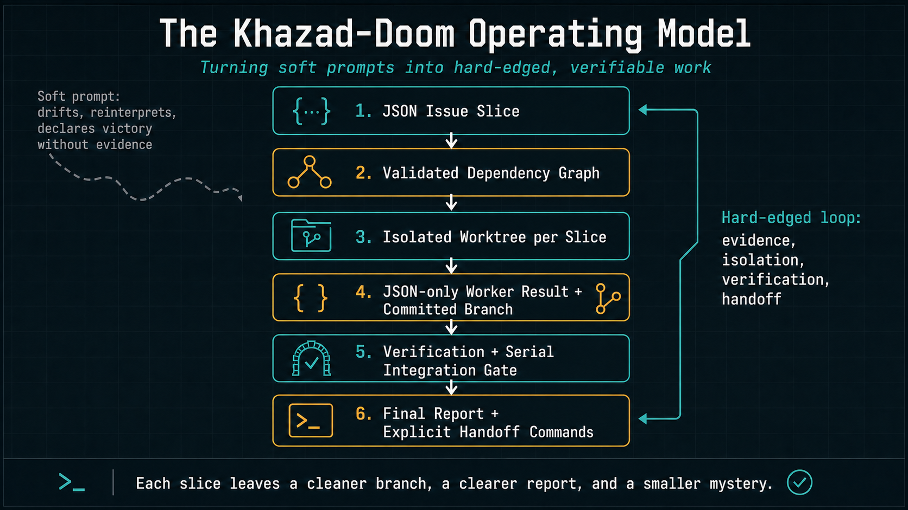

<p align="center">
  
</p>

<h1 align="center">Khazad-Doom</h1>

<p align="center">
  <em>Guard the schema. Block the slope. Ship with proof.</em>
</p>

<p align="center">
  
  
  
  
  
  
</p>

---

Agent work goes downhill quietly: one vague instruction becomes six unrelated edits, a dirty worktree, and a victory paragraph where proof should be.

Khazad-Doom is the bridge guard for that moment: **you shall not slop.**

It makes the contract explicit before the agent starts. A **JSON Issue Slice** says what is authorized, what must be verified, and when the worker must stop and ask. The daemon hands that slice to a Pi worker in an isolated worktree, demands a commit and a JSON result, gates integration, and leaves a PR-ready handoff instead of vibes.

## What Khazad-Doom is

Khazad-Doom is a local Rust CLI and daemon that turns Pi coding work into bounded, reviewable units.

It does not try to be the agent. It is the foreman around Pi:

- **plan in JSON** so scope is explicit and diffable
- **run in worktrees** so each worker is isolated
- **verify before merge** so done means proven
- **checkpoint progress** so interrupted runs can resume cleanly
- **handoff with commands** so pushing and PR creation stay intentional

The agent writes code. Khazad-Doom decides what counts as done.

Two boundaries keep this honest. Worker execution is Pi-native: Khazad-Doom launches real workers through Pi and commits to Pi's documented surfaces instead of abstracting over harnesses that don't exist. Workflow state is neutral: slices, runs, incidents, and handoffs are plain JSON on disk that any tool, script, or human can read. The built-in `fake` worker is a deterministic smoke-test seam, not a second harness strategy. Session-scoped delegation — subagents, review chains, second opinions — belongs to Pi packages like pi-subagents. Khazad-Doom owns what outlives a session: dependency-ordered slices, integration branches, durable checkpoints, and evidence.

Three shortcuts are intentionally rejected: Pi-side acceptance gates cannot replace daemon verification, silent `fallbackModels` failover cannot hide which model did the work, and Khazad-Doom will not auto-login or mutate Pi credentials. Environmental fixes stay explicit operator action.

## The operating model

A normal prompt is soft: it can drift, reinterpret itself, and declare victory without evidence.

Khazad-Doom makes the work hard-edged:

<p align="center">
  
</p>

That loop is the point. Every slice should leave behind a cleaner branch, a clearer report, and a smaller mystery for the next person or agent.

## Quick start

Install from a checkout:

```bash
cargo install --path .
```

Initialize a repository and run one slice:

```bash
khazad-doom init
khazad-doom slices new \
  --id slice-001 \
  --title "Add retry policy" \
  --goal "Add bounded retries for transient job failures" \
  --verify "cargo test"
khazad-doom slices validate

# Optional live dashboard in another terminal from this repo:
khazad-doom monitor --repo . --latest

khazad-doom run --slice slice-001
khazad-doom handoff --run <run-id>
```

For a deterministic smoke test that does not invoke Pi, keep the same dashboard open and run:

```bash
khazad-doom run --agent fake --all
```

## Issue Slices

An Issue Slice is the smallest unit of work Khazad-Doom will hand to an agent. It is narrower than a GitHub issue and stricter than a prompt.

```json
{
  "id": "slice-001",
  "title": "Add retry policy",
  "goal": "Add bounded retry behavior for transient job failures.",
  "github_issue": "https://github.com/org/repo/issues/123",
  "depends_on": [],
  "areas": ["internal/jobs", "tests/jobs"],
  "acceptance": [
    "Transient failures retry up to 3 times.",
    "Permanent failures are not retried.",
    "Existing idempotency behavior is preserved."
  ],
  "must_ask_if": [
    "Public retry config shape must change.",
    "Auth/session behavior changes.",
    "Acceptance criteria conflict."
  ],
  "verify_profile": "quick",
  "verify": ["cargo test"],
  "verify_timeout_seconds": 600
}
```

The JSON wins over chat. `must_ask_if` is the line where the worker must stop and ask instead of guessing.

Strict does not mean frozen. Acceptance criteria are minimum evidence, not an exhaustive case inventory. The rule is: **learning is allowed inside the fence; moving the fence requires approval**. If TDD or code inspection reveals a case directly implied by the slice goal/acceptance and inside declared `areas`, the worker may implement the smallest clear fix and report the discovery. If it changes product intent, public API semantics, dependencies, verification policy, or required paths outside `areas`, the worker must return an `ask-user` blocker or recommend a follow-up slice.

## What the gate enforces

| Guarantee | Why it matters |
|---|---|
| Bounded work | Each worker receives exactly one slice and its declared context. |
| Dependency order | Requested open slices include open dependencies, skip closed dependencies, and reject cycles. |
| Worktree isolation | Parallel workers cannot trample the same checkout. |
| Parallel layer safety | Every spawned worker in a parallel batch is joined and recorded before success/failure; integration starts only after the whole layer succeeds. |
| Structured output | Worker and repair results must be machine-readable JSON. |
| Evidence separation | Workers produce acceptance evidence claims; daemon checks/gates attest or reject them. Workers do not approve their own evidence. |
| Committed handoff | Completed slice work must be committed with a clean worktree. |
| Verification | Slice commands and profile commands run before integration completes. |
| Live observability | Every daemon-owned run has a durable progress snapshot for `status`, `monitor`, `watch`, and the Pi overlay. |
| Durable checkpoints | `resume` continues remaining work from recorded state instead of pretending nothing happened. |
| Conflict artifacts | Merge conflicts become structured blocked reports, not half-merged chaos. |
| Explicit PR control | `handoff` prints commands by default; push and PR creation require explicit flags or config. |

Behavior-preserving refactor guardrails are collected in [`docs/workflow-invariants.md`](docs/workflow-invariants.md).

## Slice lifecycle

Slices use a small issue-style lifecycle. New slices are `open` by default. A successful daemon run closes completed slice JSON in the integration branch with `status: "closed"`, `closed_by_run`, and `closed_at`. Future runs skip closed dependencies instead of launching historical work again, and explicitly requesting a closed slice is rejected; create a follow-up slice for new work.

Final reports and handoff JSON include explicit `exit_states` plus `evidence_attestation`. These are read-only summaries over existing worker, slice, gate, and handoff states; they do not add another gate or let a worker approve its own evidence.

## Live progress

Live progress is daemon-owned, so you can watch a run from any terminal, with or without Pi open:

```bash
khazad-doom monitor --repo . --latest
```

`monitor` is a dashboard TUI (terminal user interface). With `--latest`, it waits for the latest active run in the selected repository, attaches when one appears, and can stay open while runs are started from Pi, a script, or another terminal. If no active run exists, it keeps the latest terminal run visible instead of dropping important completion/failure context. `Ctrl-C` exits only the terminal monitor; the daemon is detached from the monitor process group and keeps owning any run. Khazad-Doom does not auto-open external windows by default.

Run the command above from the repo checkout; from elsewhere, use the absolute `monitor_command` printed by `khazad-doom run`. `khazad-doom run` returns JSON with `run_id`, absolute `repo_path`, `monitor_command`, and `run_monitor_command`, so whatever started the run can display those commands directly instead of guessing how to launch user-visible progress.

Use `watch --run <run-id>` as the plain text fallback when a dashboard TUI is not suitable. The terminal `monitor` and optional Pi overlay intentionally share the same activity-feed vocabulary over daemon `status` JSON: `Todos`, `Run`, current `Worker`/`Shell`/`Merge`/`Repair`, `Warn`, `Economics`, `Incidents`, `Activity`, and `Tail`.

During `worker_running` and `integration_repair`, status/watch/monitor separate supervisor liveness from worker output activity. For parallel worker layers, they also label the layer and list active slices:

```text
Todos (2 items)
◐ slice-001  running
☐ slice-002  pending

Run ● running • kd-20260627-090458-b91f6fbf
└ phase parallel_worker_layer (worker_running) • elapsed 22m14s
└ repo …/example/repo
└ slice worker is running

Worker (parallel layer: slice-001, slice-002 • attempt 1 • now)
└ Parallel layer: slice-001, slice-002
└ Supervisor: alive, observed child 8s ago
└ Process: running pid=12345
└ Runtime: 22m14s
└ Last worker event: none
└ Last semantic progress: unknown
└ Timeout: disabled

Warn
└ worker is quiet for 15m00s; this may be normal; no timeout configured
└ wait, inspect, or cancel explicitly
```

A quiet worker is not considered failed by default. Khazad-Doom reports that the daemon is still supervising the process, shows when stdout/stderr/JSON events last arrived, and leaves the wait/inspect/cancel decision explicit unless a repo config opts into a worker-attempt timeout. The status JSON includes `progress.parallel_layer: true` and `progress.parallel_slices` while a parallel worker layer is active.

Runs also expose an `incidents` array in status JSON and monitor output. A final `completed` status does not hide prior run errors, resumes, cleanup warnings, integration repair, or non-fatal lifecycle warnings; those are escalated as completed-with-incidents signals for release triage.

### The Pi package: skill and overlay

This repository is also a Pi package. Its `package.json` declares the `khazad-doom` skill and a monitor extension at `extensions/khazad-monitor`. Both are adapters over daemon state; neither owns a run.

Enable it intentionally from a trusted checkout or package source; Khazad-Doom never writes Pi user settings automatically:

```bash
pi install /path/to/khazad-doom
# or try for one Pi session:
pi -e /path/to/khazad-doom
```

The extension registers `/khazad-monitor`:

```text
/khazad-monitor --latest [--repo /path/to/repo]
/khazad-monitor --run <run-id>
/khazad-monitor <run-id>
```

In Pi TUI mode it opens a centered, bordered version of the same activity-feed dashboard as `khazad-doom monitor`: slice todos, current worker/shell progress, warnings, economics, chronological daemon activity, and output-tail fields from daemon JSON. When the feed is taller than the overlay, it shows a right-side scrollbar; use ↑/↓ or PgUp/PgDn to scroll. Press `q` or `Esc` to close only the overlay; it never calls `cancel` and never owns the daemon run lifetime. Outside Pi TUI mode, or when `khazad-doom` is unavailable, it shows clear fallback commands instead of stack traces.

To install only the skill without the optional extension, use Pi package filters in settings:

```json
{
  "packages": [
    { "source": "/path/to/khazad-doom", "extensions": [] }
  ]
}
```

## Commands

| Command | What it does |
|---|---|
| `khazad-doom init` | Create `.workflow/` and register the repo. |
| `khazad-doom slices new ...` | Generate a JSON Issue Slice template. |
| `khazad-doom slices import-github --issue <url>` | Import a GitHub issue via `gh issue view`. |
| `khazad-doom slices import-github --issue <url> --dry-run` | Preview generated slice JSON without writing. |
| `khazad-doom slices validate` | Validate slice JSON, IDs, dependencies, and cycles. |
| `khazad-doom slices list` | Print compact slice summaries. |
| `khazad-doom slices schema --write` | Write the JSON Schema for editor and CI validation. |
| `khazad-doom run --slice <id>` | Run one open slice plus open dependencies; closed dependencies are treated as satisfied. |
| `khazad-doom run --all --parallel <n>` | Run all open slices; independent workers may run concurrently, then integrate only after the whole parallel layer succeeds. |
| `khazad-doom run --allow-dirty ...` | Explicitly allow a dirty source repo; the preflight artifact records the dirty snapshot. |
| `khazad-doom resume --run <id>` | Continue an interrupted, failed, or cancelled run from checkpoint. |
| `khazad-doom status` | Show recent runs. |
| `khazad-doom status --run <id>` | Show one run, slice states, progress snapshot, and events. |
| `khazad-doom status --run <id> --follow` | Follow compact live progress until the run reaches a terminal state. |
| `khazad-doom status --repo . --latest --include-terminal` | Return the latest active run, or latest terminal run when none is active. |
| `khazad-doom monitor --repo . --latest` | Open the dashboard TUI for the latest active run in this repo. |
| `khazad-doom monitor --run <id>` | Open the dashboard TUI for one specific run. |
| `khazad-doom watch --run <id>` | Plain text fallback for one specific run. |
| `khazad-doom inspect --run <id>` | List run artifacts and a bounded daemon log tail. |
| `khazad-doom inspect --repo . --latest` | Inspect the latest run for a repo, including terminal runs. |
| `khazad-doom cancel --run <id>` | Request cancellation. |
| `khazad-doom handoff --run <id>` | Print push/PR handoff JSON for a completed run. |
| `khazad-doom handoff --run <id> --push --create-pr` | Explicitly push and open a PR with `gh`. |
| `khazad-doom daemon start` | Start the local daemon. |
| `khazad-doom daemon status` | Show daemon process/status information. |
| `khazad-doom daemon stop` | Stop the daemon when no runs are active. |

## Runners

Pi is the worker harness — the only one. The second runner, `fake`, is a test double, not a harness: it exists so the daemon can be exercised end to end without spending a token.

```bash
khazad-doom run --agent pi --slice slice-001
khazad-doom run --agent fake --all
KHAZAD_AGENT=fake khazad-doom run --all
KHAZAD_PI_BIN=/path/to/pi KHAZAD_PI_ARGS="--some-arg" khazad-doom run --agent pi --all
```

`fake` is deliberately boring: it commits predictable fixture files and returns valid worker JSON. Use it for daemon tests, demos, and dogfooding the workflow itself.

## Repository config

`khazad-doom init` creates `.workflow/khazad.json`. Commit it when you want shared defaults:

```json
{
  "agent": "pi",
  "parallelism": 3,
  "verify_timeout_seconds": 600,
  "worker_attempt_timeout_seconds": 0,
  "worker_no_output_warning_seconds": 900,
  "worker_termination_grace_seconds": 30,
  "integration_repair": "auto",
  "gate_fail_fast": true,
  "handoff": { "push": false, "create_pr": false },
  "verify_profiles": {
    "quick": {
      "commands": [
        { "command": "cargo fmt --check", "timeout_seconds": 120 },
        { "command": "cargo test", "timeout_seconds": 240 }
      ]
    }
  }
}
```

A slice can reference `"verify_profile": "quick"` and still add inline `verify` commands. Profile commands support repo-relative `cwd`, `env`, and per-command timeouts. Integration gate command order follows profile/inline order, exact duplicates are merged within a gate, and `gate_fail_fast` skips later gate commands after the first failure. Missing tools, invalid verify cwd, shell spawn failures, and non-executable commands are classified as daemon/operator environment failures instead of worker auto-fix failures.

`khazad-doom init` also creates `.workflow/agents.toml`, the central launch-profile file for agent roles. Real Pi code-writing workers are launched through the required `implementer` profile; the default enforces OpenAI `gpt-5.5`, `xhigh` reasoning, and `fast` mode metadata, while appending the matching Pi `--provider`, `--model`, and `--thinking` flags before worker start. The fake adapter is exempt for deterministic smoke tests. Worker handoff JSON, run events, and economics snapshots report the actual profile/model/settings used.

Run start is clean-by-default: Khazad-Doom rejects a dirty source repo unless `--allow-dirty` is explicit, and every run writes `.workflow/runs/<run>/outputs/preflight.json` with base branch/SHA and dirty status. Worker changes are also checked against slice `areas` when areas are declared; outside-area changes block the slice as a scope violation.

`integration_repair` controls when the repair agent runs: `auto` runs repair only after failed integration-gate evidence, `never` surfaces the failed gate without repair, and `always` runs repair even when the pre-repair gate passed. Repair never bypasses the gate; any repair is followed by a second integration gate.

Status/watch/monitor and final reports include runtime economics for release triage: agent call counts, daemon-owned command execution counts, duplicate command telemetry, cache hits/misses, repair policy/attempts, phase durations, and SLA violations.

Khazad-Doom does not use a hidden global workflow timeout. Runs are daemon-owned and may outlive the CLI or Pi tool call that started them. Timeouts are explicit guardrails for individual verification/gate commands so hung shell commands do not stall a run forever.

Worker supervision has separate knobs:

- `worker_attempt_timeout_seconds`: explicit per-worker-attempt cap. `0` disables fatal timeout, which is the default.
- `worker_no_output_warning_seconds`: advisory quiet-worker warning threshold for monitor/watch/status. Missing output alone is not failure.
- `worker_termination_grace_seconds`: grace period used when Khazad-Doom asks a Pi worker process to stop before force-kill escalation.

Retries preserve attempt history and should be treated as at-least-once execution, not exactly-once continuation.

## Files and state

| Path | Purpose |
|---|---|
| `.workflow/khazad.json` | Shared repo defaults and verification profiles. |
| `.workflow/agents.toml` | Central per-role agent model/settings profiles; `implementer` is required for real code-writing workers. |
| `.workflow/slices/*.json` | Durable machine-readable Issue Slices. |
| `.workflow/schema/slice.schema.json` | JSON Schema for editor/CI validation. |
| `.workflow/plans/` | Optional planning artifacts. |
| `.workflow/reports/` | Reports committed to integration branches. |
| `.workflow/runs/` | Transient handoffs, preflight snapshots, terminal run summaries, attempt diagnostics, and raw outputs; gitignored. |
| `~/.khazad-doom/socket` | Daemon IPC socket. |
| `~/.khazad-doom/state.sqlite` | Run, slice, event, and live progress state. |
| `~/.khazad-doom/worktrees/` | Daemon-managed temporary worktrees. |

If the daemon starts and finds active runs from a previous process, it marks them `interrupted`, records recovery events, and cleans daemon worktrees where possible. `khazad-doom resume --run <id>` is explicit: it reuses the integration branch and checkpoint state for remaining slices.

## Handoff

`khazad-doom handoff --run <run-id>` prints JSON containing:

- integration branch
- base branch and base SHA
- final SHA
- summary and report paths
- suggested `git push` command
- suggested `gh pr create` command

By default it does not push and does not open a PR. Add `--push --create-pr` when you want Khazad-Doom to run those commands explicitly. Use `--dry-run` to inspect commands and diagnostics even if repo config enables default handoff actions.

## Development

```bash
cargo fmt --check
cargo test
cargo clippy --all-targets --all-features -- -D warnings
bash -n scripts/install.sh scripts/package.sh
```

Run the daemon path through the fake runner:

```bash
cargo test --test daemon_integration
```

Package a local release tarball:

```bash
scripts/package.sh
```

Create a release by pushing a `v*` tag. CI builds the package tarball, writes `SHA256SUMS`, and attaches both to the GitHub release.

## FAQ

**Is Khazad-Doom an agent?**
No. It is the foreman around an agent. It gives agents bounded work, checks the result, and records evidence.

**Why JSON?**
Because prose is where scope creep hides. JSON is compact, diffable, validatable, and explicit.

**Can it resume a crashed worker?**
No. A lost worker becomes an `interrupted` slice. `resume` continues remaining slices from durable checkpoints; it does not resurrect dead processes.

**Does `handoff` create a PR?**
Only with `--create-pr`; use `--push` when the integration branch also needs to be pushed. You stay in control.

**Why the name?**
Because something has to stand on the bridge.

## License

MIT.
